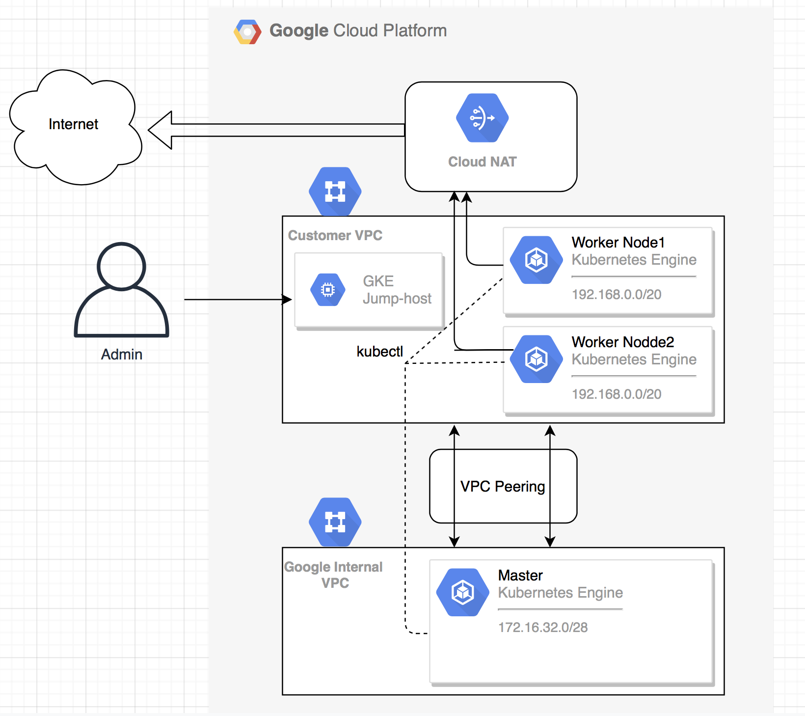

# GKE Private Cluster with Enhanced Security

This repository contains Terraform configurations for deploying a secure, private Google Kubernetes Engine (GKE) cluster

## Architecture



## Features

- **Private GKE Cluster**
  - Private nodes (no public IPs)
  - Private control plane
  - Authorized networks for master access
  - Workload Identity enabled

- **Network Security**
  - Custom VPC with private subnets
  - Cloud NAT for outbound internet access
  - VPC Service Controls (optional)
  - Network Policy enabled with Calico
  - IAP-based SSH access

- **Security Controls**
  - Shielded Nodes enabled
  - Binary Authorization
  - Workload Identity
  - Security Command Center integration
  - Container-Optimized OS
  - Regular security patches via Release Channel

- **Monitoring & Logging**
  - Cloud Operations integration
  - VPC Flow Logs
  - Cloud Audit Logs
  - Managed Prometheus
  - Custom monitoring dashboards

## Prerequisites

- Terraform >= 1.0
- Google Cloud SDK
- Required Google Cloud APIs enabled:
  - Container API
  - Compute Engine API
  - Cloud Resource Manager API
  - Identity and Access Management API
  - Cloud KMS API (if using CMEK)

## Required IAM Permissions

The service account or user deploying this infrastructure needs the following roles:
- `roles/container.admin`
- `roles/compute.admin`
- `roles/iam.serviceAccountAdmin`
- `roles/serviceusage.serviceUsageAdmin`
- `roles/resourcemanager.projectIamAdmin`

## Usage

1. Initialize Terraform:
   ```bash
   terraform init
   ```

2. Create a `terraform.tfvars` file with your configuration:
   ```hcl
   project         = "your-project-id"
   cluster_name    = "private-gke-cluster"
   region          = "us-central1"
   domain          = "yourdomain.com"
   environment     = "prod"
   ```

3. Review the plan:
   ```bash
   terraform plan
   ```

4. Apply the configuration:
   ```bash
   terraform apply
   ```

## Accessing the Cluster

To access the cluster, you'll need to:

1. Configure IAP for TCP forwarding:
   ```bash
   gcloud compute ssh gke-bastion --tunnel-through-iap
   ```

2. Configure kubectl:
   ```bash
   gcloud container clusters get-credentials private-gke-cluster --region us-central1 --project your-project-id
   ```

## Security Best Practices

1. **Workload Identity**: Use Workload Identity instead of node service accounts
2. **Network Policy**: Define network policies for pod-to-pod communication
3. **Binary Authorization**: Enable Binary Authorization for container image verification
4. **Regular Updates**: Use Release Channels for automated upgrades
5. **Access Control**: Implement least privilege access using IAM
6. **Monitoring**: Enable all security monitoring features
7. **VPC Service Controls**: Consider enabling VPC Service Controls for additional security

## Maintenance

- The cluster is configured to automatically upgrade using the Regular release channel
- Maintenance windows are scheduled for weekends
- Node auto-repair and auto-upgrade are enabled
- Regular security patches are automatically applied

## Version Compatibility

- Terraform: >= 1.0
- Google Provider: ~> 5.0
- GKE: Latest stable version (automatically managed via Release Channel)

## Contributing

1. Fork the repository
2. Create a feature branch
3. Commit your changes
4. Push to the branch
5. Create a Pull Request

## License

This project is licensed under the MIT License - see the LICENSE file for details!!! Enjoy!!!